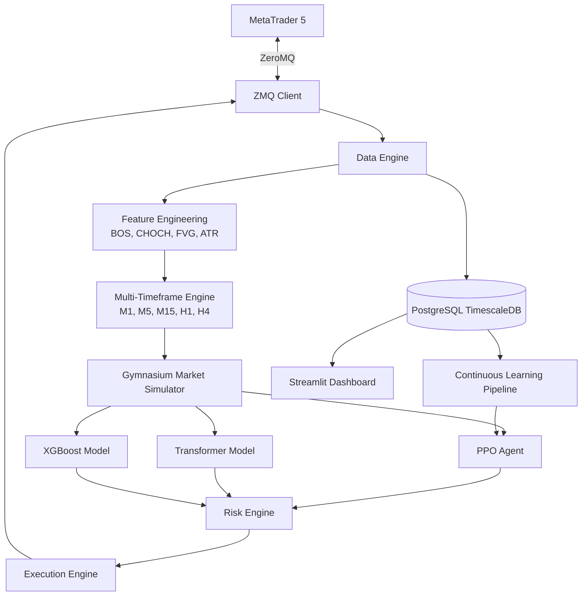

# AI Trading Infrastructure Architecture

## Implementation Roadmap
1. **Phase 1**: MT5 ZeroMQ Bridge & Core Config
2. **Phase 2**: Feature Engineering & MTF Aggregation
3. **Phase 3**: Gymnasium Environment & Simulation
4. **Phase 4**: PyTorch AI Models (Transformer, PPO, XGB)
5. **Phase 5**: Execution & Risk Engines
6. **Phase 6**: Streamlit Dashboard & Dockerization
